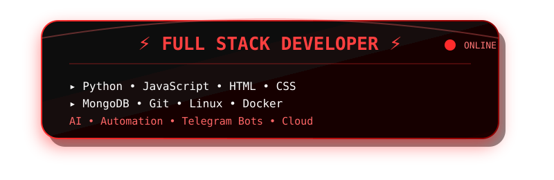

  

<h1 align="center">
  
</h1>

<h2 align="center">⚡ SYSTEM STATUS ⚡</h2>

  

---

<h2 align="center">📊 DEV ANALYTICS 📊

  

</h2>

---

<h2 align="center">🔄 DEV METRICS 🔄</h2>

---

<h2 align="center">📊 TECH STACK ANALYSIS</h2>

---

## 💻 Developer Profile

| Attribute | Value |
|-----------|-------|
| 👤 Name | **Sangam Singh** |
| 🌍 Location | 🇮🇳 India |
| 💻 Role | Full Stack & AI Developer |
| 🐍 Primary Language | Python |
| ☁️ Cloud Stack | MongoDB, AWS, GCP |
| ⚡ Speciality | Automation & Scalable Systems |
| 🎯 Mission | Build Innovative Tech Solutions |
| 🚀 Focus | AI Integration & Cloud Architecture |
| 🏅 Status | S-Class Developer |

---

## ⚡ Dev Status

---

<h2 align="center">🛠️ Tech Stack • Frameworks • Tools</h2>

<h2 align="center">💻 Development Environment</h2>

  

  

---

<h2 align="center">📫 Connect & Collaborate</h2>

  
  
  
  

  

